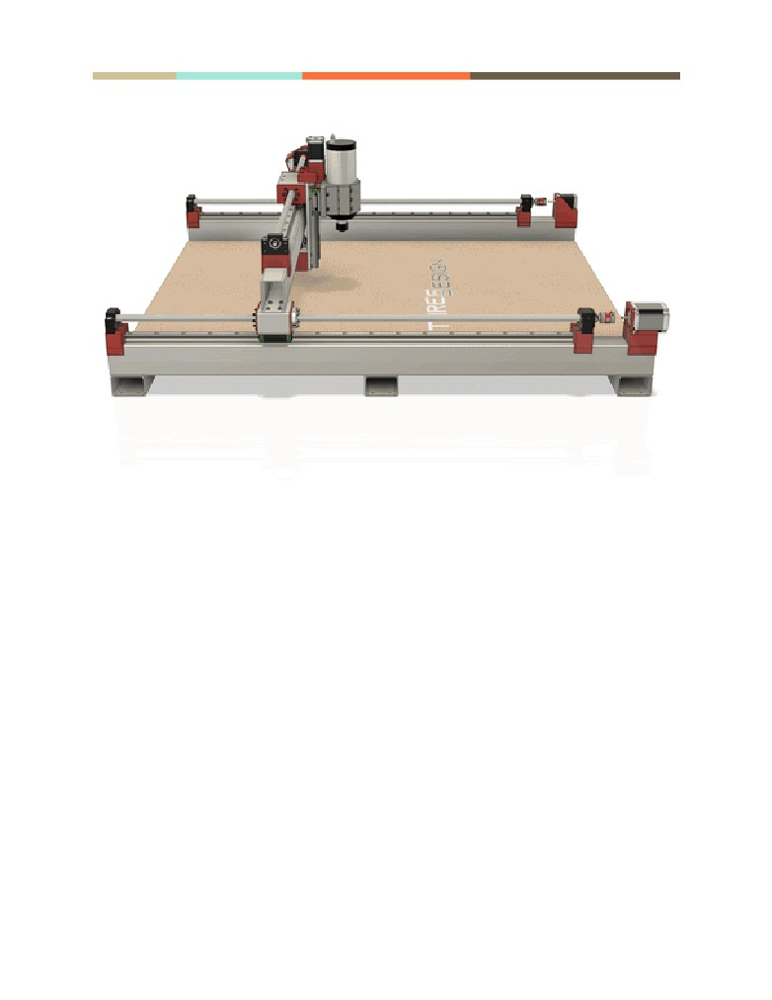

# 1. Y-Axis Frame Prep

Summary : Create M6 threaded holes for mounting and one M5 unthreaded at the front for cable passthrough.

### Hardware Needed:

- [ ] Center punch
- [ ] Drill
- [ ] M5 Drill bit
- [ ] M6 Tap bit
- [ ] Pencil
- [ ] (2) Y-Axis frame beams

### Printed Parts Needed:

- [ ] Assembly Tool #1 - Y Frame
Marker
- [ ] Assembly Tool #3 - Y Frame
Mid Marker
- [ ] Center Line Marker Tool

### When complete, verify:

- [ ] All holes drilled in this step are on the bottom surface of the beams
- [ ] Each beam should have a center line marked on the top surface.
- [ ] One end of one Y-axis frame beam should have 5 holes, as shown in Figure 1.4.
- [ ] The other end of that beam, as well as both ends of all other Y-axis frame
beams should have 4 holes.
- [ ] All Y-axis frame beams should have 4 holes at the center
- [ ] All holes except for the center hole in Figure 1.4 should be threaded to
accept an M6 bolt.

## Build Steps:

1. Position Assembly Tool #1 on the top face of one Y-Axis frame beam with the
    number on the printed part facing down and all tabs securely holding position as
    shown in Figure 1.1.
	
2. Mark all 4 corner holes with a center punch.
3. Mark the center hole with a center punch. The center hole is only used once and
    only on the first beam where a wire will be passed to connect an endstop switch.
4. Repeat steps 1.1-1.2, skipping step 1.3 on the other end of the Y-Axis frame beam
    and both ends of the other beam.
5. Find and mark the center point of the exposed bottom face of each beam.
6. Position Assembly Tool #3 at the middle of the frame beam as shown in Figure 1.2,
    using the hole in the center of the printed tool to align it precisely to the center
    point mark made in the previous step.

7. Mark the 4 holes around the edges with a center punch. Do not mark the center
    hole.
8. Drill all marked points with an M5 bit.
9. Thread all holes made in the previous step except the center hole marked in step
    1.1 with an M6 tap bit. That hole can be tapped, but it’s not necessary.
10.Flip the Y-Axis frame beams so the holes are facing down.
11.Position the Center Line Marker Tool on the top face as shown in Figure 1.3.
12.Place a pencil or other marking tool at the center of the v shaped grove on the
    Center Line Marker Tool and hold it there securely.
13.Run the Center Line Marker Tool down the length of the beam while using the
    marking tool to mark the center. Measure your centerline at several places to
    ensure it is indeed properly centered.
14.Repeat previous 3 steps for the other Y-Axis frame beam.